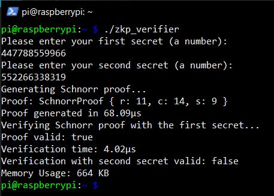

# Project Title

**Author:** Amil Shrivastava

## Introduction

This project is a simple implementation of Schnorr's Zero-Knowledge Proof (ZKP) in Rust, designed to be cross-compiled and run on a Raspberry Pi. The application prompts the user to input two different secrets and demonstrates the ability to prove that it verifies one of the secrets while not revealing it. Additionally, it logs the performance of the Raspberry Pi during the verification and proof processes.

## Features
- Schnorr's Zero-Knowledge Proof (ZKP) implementation
- Asks user to input two different secrets
- Proves that it verifies one of the secrets while not revealing it, and refutes the second secret
- Cross-compiled executable for Raspberry Pi
- Screenshot of Rpi execution:



## How to run

- You can build and run it with 

 ```bash
  cargo run
 ```

- To run it on Raspberry Pi, find the zkp_verifier in the following location and transfer it on to the pi and then execute it
